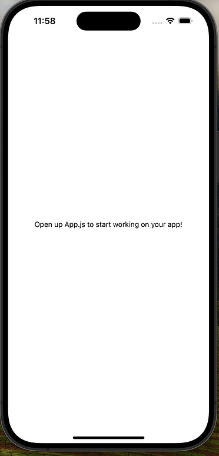
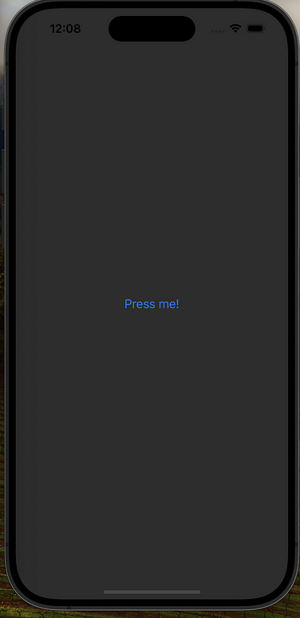
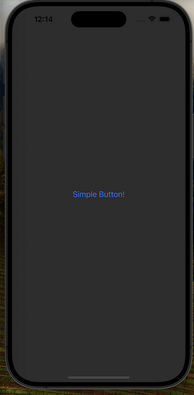
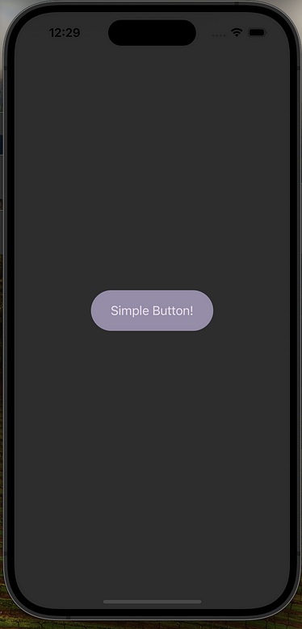
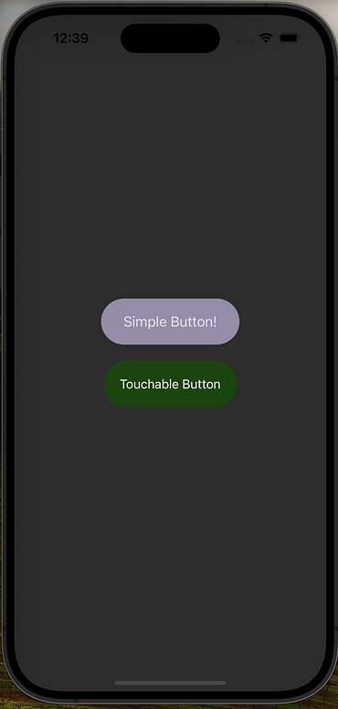
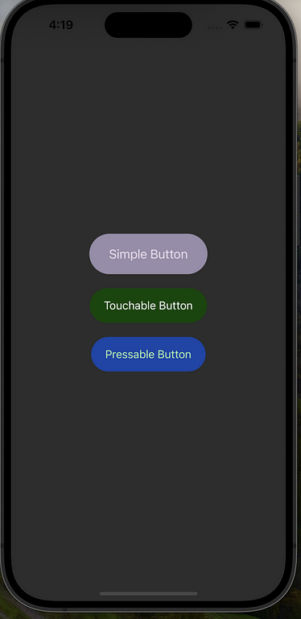
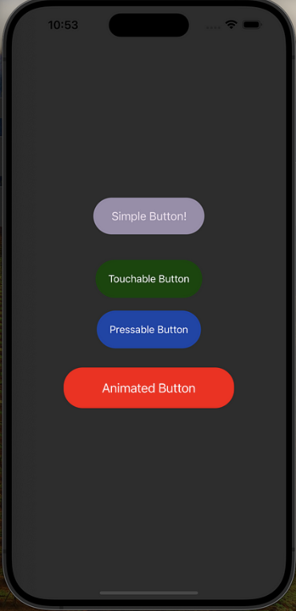

# rn-expo-animated-buttons

A guide for implementing buttons in React Native and Expo using the React Native Reanimated library

<div style="display:flex; flex-direction:row; flex-wrap: wrap;">
  
  
  
  
  
  
  
  
</div>

## Project Setup & Available Scripts

- Clone the repo on local machine and before running below scripts make sure that you have `Node.js` and `npm` or `yarn` installed globally.
- Install packages

```shell
npm install
```

- Run the Expo Server

```shell
npx expo start
```

- Open an iOS simulator press `i`
- Open an Android emulator press `a`
- Scan QR Code to Run the app on physical device via **Expo Go** app

## Contributing Guideline

You are welcome to contribute to this project, please see the issue list before filing a new issue.

## License

This project is under [MIT License](./LICENSE)
