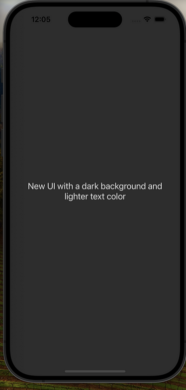

# [rn-expo-animated-buttons](https://medium.com/devsorigin/crafting-accessible-and-animated-buttons-in-react-native-and-expo-app-a2633311c3bb)

A guide for implementing buttons in React Native and Expo using the React Native Reanimated library. Read the [full blog here](https://medium.com/devsorigin/crafting-accessible-and-animated-buttons-in-react-native-and-expo-app-a2633311c3bb).

<div style="display:flex; flex-direction:row; flex-wrap: wrap;">
  
  
  
  
  
  
  
  
</div>

## Project Setup & Available Scripts

Clone the repo on the local machine and before running the below scripts make sure that you have `Node.js` and `npm` or `yarn` installed globally. Don't know how to get started with `React Native` and `Expo` follow the below guide:
- React Native Official Guide to [Setting up the Development Environment](https://reactnative.dev/docs/environment-setup)
- Expo Docs to [Create your first app with React Native and Expo](https://docs.expo.dev/tutorial/create-your-first-app/)
- a straightforward guide to [Building Your First Mobile App with React Native and Expo](https://medium.com/devsorigin/building-your-first-mobile-app-with-react-native-and-expo-a-comprehensive-guide-249d2a61a265)

### Install packages

``` shell
npm install
```

### Run the Expo Server

``` shell
npx expo start
```

- Open an iOS simulator to press `i`
- Open an Android emulator to press `a`
- Scan the QR Code to Run the app on the physical device via the **Expo Go** app

## Contributing Guideline

You are welcome to contribute to this project, please see the issue list before filing a new issue.

## License

This project is under [MIT License](./LICENSE)
